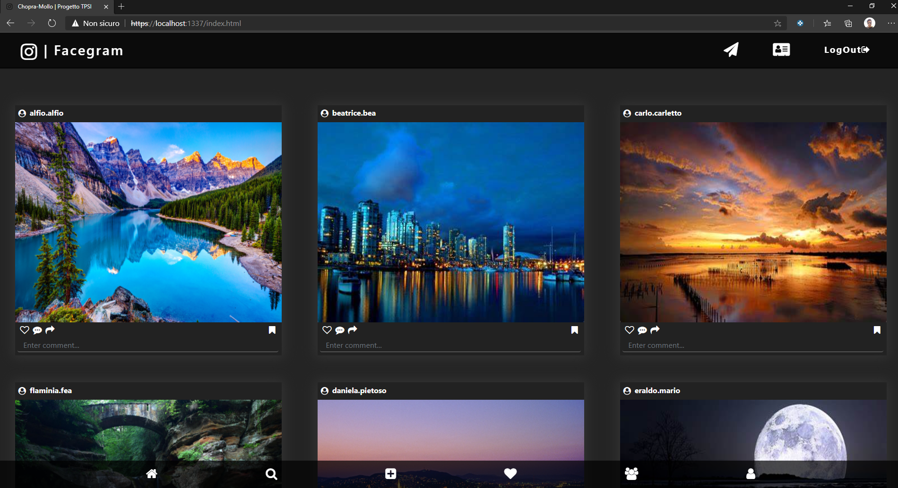
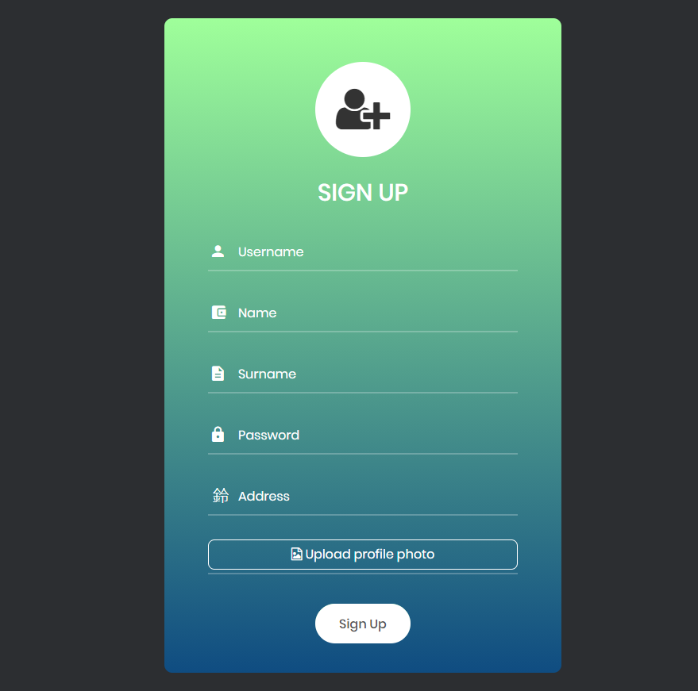
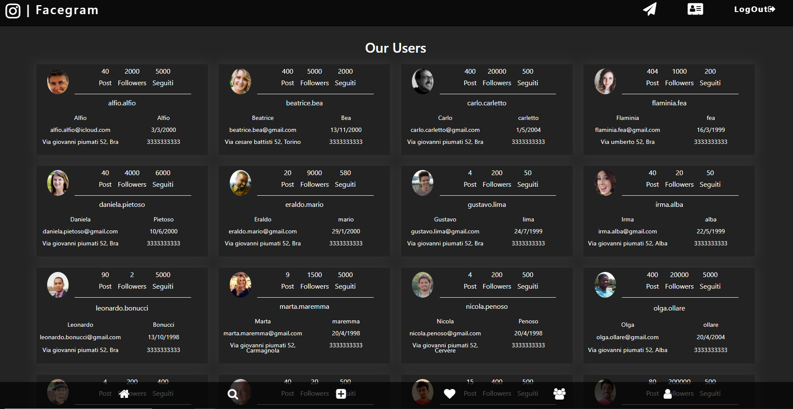
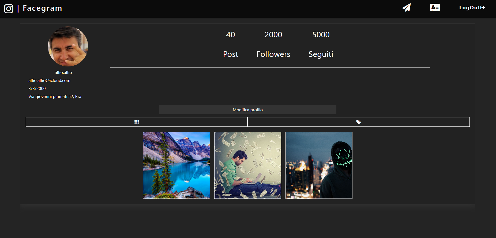
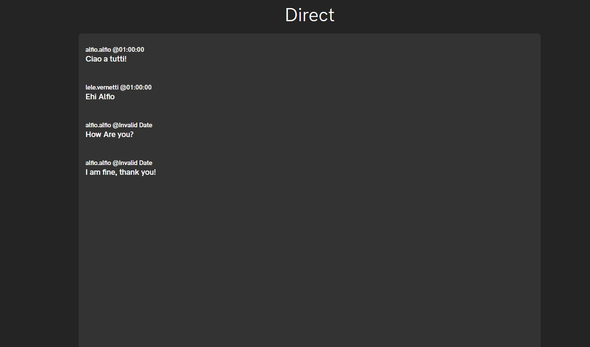
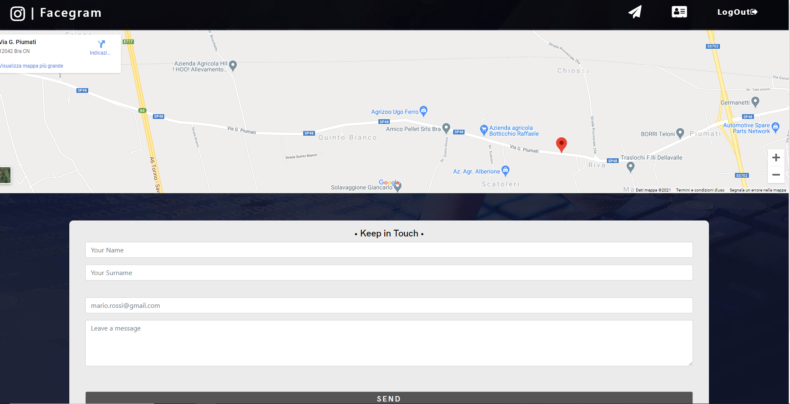

# Facegram 
#### Autore: Chopra Deepak - Mollo Niccolò

## Main Page

## Funzionamento
All'avvio viene richiesto di effettuare il login, volendo si può anche creare un nuovo utente. Successivamente si passa alla pagina principale, dove:
- in alto, abbiamo una navbar contenente un logo ed dei pulsanti che portano alle relative pagine (direct, contactMe) e anche il pulsante per il logOut
- in seguito, abbiamo la section dove vengono caricati tutti i post in base agli utenti
- in basso, abbiamo un footer contenente le varie icone che portano alle relative pagine

### Registrazione nuovo utente
Per la registrazione, nella pagina di login, abbiamo sotto al button di sumbit un link alla pagina di registrazione. Dopo la registrazione, se è andato tutto a buon fine, l'utente viene portato alla pagina principale

### Users Page
In questa pagina vengono visualizzati tutti gli utenti presenti nel db e le loro informazioni

### Profile Page
L'utente che ha effettuato l'accesso può visualizzare questa pagina dove vengono mostrate le sue informazioni

### Chat Page

### Contact me Page

## Database
Il database ha 3 tabelle:
- utenti, contenente i dati degli utenti 
- post, contenente i post per i vari utenti
- messaggi, usato per lo storico dei messaggi

### Struttura cartella
Per ciascun tipo di file abbiamo una cartella specifica:
- css -> per i file .css
- database -> contiene il database
- fonts -> contiene i fonts utilizzati per l'intera applicazione
- images -> contiene le foto utilizzate
- js -> per i file .js
- pagine -> contiene le altre pagine .html
- keys -> per i certificati e le chiavi
- vendor -> cartella che contiene tutte le librerie neccesarie

## Bug e problemi
- A volte succede che il server vada in timeout, credo sia legato ad Atlas che a volte non risponde correttamente 
- A volte invece è un problema di cache, infatti, tenendo aperto l'ispector il problema si risolve (ho già provato a debuggare moltissimo ma non è mai uscito un errore)
- Sempre per alcuni bug e rallentamenti causati da Atlas, ho diminuito le query e di conseguenza le operazioni sul db che facevo

## Team sviluppatori:
> 5B Info - Vallauri Fossano Italy